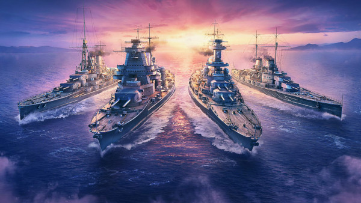
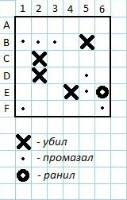

# Ура! Морской бой на Node.js

- [Пусть морская баталия начнётся](#пусть-морская-баталия-начнётся)
- [Работа с GIT](#работа-с-git)
- [Творите](#творите)
- [Описание игрового поля](#описание-игрового-поля)
- [Описание игрового процесса](#описание-игрового-процесса)
  - [Шаг 1. Ах, игровое поле!](#шаг-1-ах-игровое-поле)
  - [Шаг 2. Ура, стреляйте!](#шаг-2-ура-стреляйте)
  - [Шаг 3. Считаем баллы и оставшиеся выстрелы](#шаг-3-считаем-баллы-и-оставшиеся-выстрелы)
  - [Шаг 4. Конец игры](#шаг-4-конец-игры)
- [Релизы, которые с каждым разом становятся все лучше и лучше](#релизы-которые-с-каждым-разом-становятся-все-лучше-и-лучше)
  - [Release 1: Базовое удовольствие](#release-1-базовое-удовольствие)
  - [Release 2: Веселье возрастает](#release-2-веселье-возрастает)
  - [Release 3: Многопалубные корабли и улучшенное отображение](#release-3-многопалубные-корабли-и-улучшенное-отображение)
  - [Release 4: Релиз под звёздочкой - игра против компьютера](#release-4-релиз-под-звёздочкой---игра-против-компьютера)
- [В БОЙ!](#в-бой)

## Пусть морская баталия начнётся

Собирайтесь с духом и создайте текстовую версию всеми любимой игры "Морской бой" на Node.js. Сначала вы сделаете однопользовательский вариант, а затем, если хватит времени, добавите возможность играть против компьютера.

## Работа с GIT

В этом проекте обязательно попрактикуйтесь с гитом. Разбейте проект на задачи и создайте для каждой из них ветку.

## Творите

Не стесняйтесь проявлять своё творчество в рамках технического задания. Поиграйтесь с отображением игрового поля, звуками или добавьте в проект свои уникальные фишки.

## Описание игрового поля

- Размер поля: 6x6 клеток.
- Корабли на поле: 1 трёхпалубный, 2 двухпалубных, 3 однопалубных.
- Корабли могут быть расположены горизонтально или вертикально и не должны касаться углами.

## Описание игрового процесса

### Шаг 1. Ах, игровое поле!

1. У вас будет два скрипта. Скрипт `generate.js` будет отвечать за генерацию игрового поля, а скрипт `fire.js` за выстрел.
2. Игровое поле генерируется скриптом `generate.js`. Запишите игровое поле со сгенерированными кораблями в файл (например, `battlefield.txt`).

### Шаг 2. Ура, стреляйте!

1. Игрок делает выстрелы, вызывая скрипт `fire.js` и указывает координаты клетки на игровом поле (например, `A1`, `B5`, `E3` и т.д.). Например: `node fire.js A1`.
2. Скрипт `fire.js` считывает содержимое файла `battlefield.txt` и проверяет, есть ли в выбранной клетке корабль.
3. В ответ игра выводит информацию об изменении на игровом поле:
   - Если в выбранной клетке нет корабля, то игроку сообщается о промахе. На игровом поле выбранная клетка отмечается соответствующим символом (например, ".")
   - Если в выбранной клетке находится часть корабля, то игроку сообщается об этом (например "Ранил" или "Убил"). На игровом поле клетка отмечается другим символом (например, "Р" и "У" соответственно).
   - Если игрок убил корабль (т.е., все его части подбиты), то игроку сообщается о потопленном корабле. Рядом с потопленным кораблём на игровом поле отмечаются клетки, показывая, что данные клетки не могут содержать другие корабли (например, "O").
4. Эти изменения должны быть записаны в файл `battlefield.txt`.

**P.S.:** Дайте волю фантазии. Вы можете использовать другие символы или даже эмодзи для отображения красивого игрового поля.

### Шаг 3. Считаем баллы и оставшиеся выстрелы

1. После каждого выстрела игроку могут добавляться очки. Например: ранил - 1 очко, убил - 5 очков.
2. Игроку даётся ограниченное количество выстрелов (например, 10).
3. После каждого выстрела игроку сообщается количество оставшихся выстрелов.
4. Количество выстрелов и очков также записывается в файл `battlefield.txt`.
5. Если игрок успел потопить все корабли до исчерпания количества выстрелов, то игроку объявляется победа.
6. Если игрок исчерпал все выстрелы, но не потопил все корабли, то объявляется поражение.

### Шаг 4. Конец игры

1. Игра выводит в консоль сообщение о результате, а также количество набранных очков:
   - Если игрок потопил все корабли: "Поздравляем, вы победили!"
   - Если игрок не потопил все корабли: "Вы проиграли. Попробуйте снова!"

## Релизы, которые с каждым разом становятся все лучше и лучше

### Release 1: Базовое удовольствие

1. Вручную создайте файл с однопалубными кораблями (например, `battlefield.txt`).
2. Реализуйте скрипт `fire.js` с возможностью сделать выстрел по полю с изменением содержимого файла `battlefield.txt`. Координаты выстрела принимаются через аргументы командной строки (process.argv). Пример вызова: `node fire.js A1`.
3. Также скрипт `fire.js` должен отображать поле после выстрела. Для этого релиза хватит отобразить клетки такого вида: пустая клетка, промах, убил.

### Release 2: Веселье возрастает

1. Реализуйте скрипт `generate.js`, который будет рандомно генерировать 8 однопалубных кораблей, учитывая, что корабли не должны касаться углами.
2. Реализуйте подсчёт очков и оставшихся выстрелов в скрипте `fire.js`.

### Release 3: Многопалубные корабли и улучшенное отображение

1. Реализуйте генерацию многопалубных кораблей в скрипте `generate.js`. В результате скрипт должен генерировать 1 трёхпалубный, 2 двухпалубных и 3 однопалубных корабля.
2. В скрипте `fire.js` улучшите отображение игрового поля: покажите разницу между "ранил" и "убил", отметьте точки вокруг убитых кораблей.
3. В скрипте `fire.js` добавьте звуковые эффекты для выстрела, попадания, промаха и уничтожения корабля.

### Release 4: Релиз под звёздочкой - игра против компьютера

1. Реализуйте возможность игры против компьютера: создайте два игровых поля (одно поле генерируется случайным образом для игрока, другое - для компьютера). Компьютер самостоятельно делает свои выстрелы.
2. Реализуйте проверку условия окончания игры и определение победителя.

## В БОЙ!

Не сдавайтесь, будущие капитаны! И помните: "Кто море любит, тот на берегу не стоит!"
